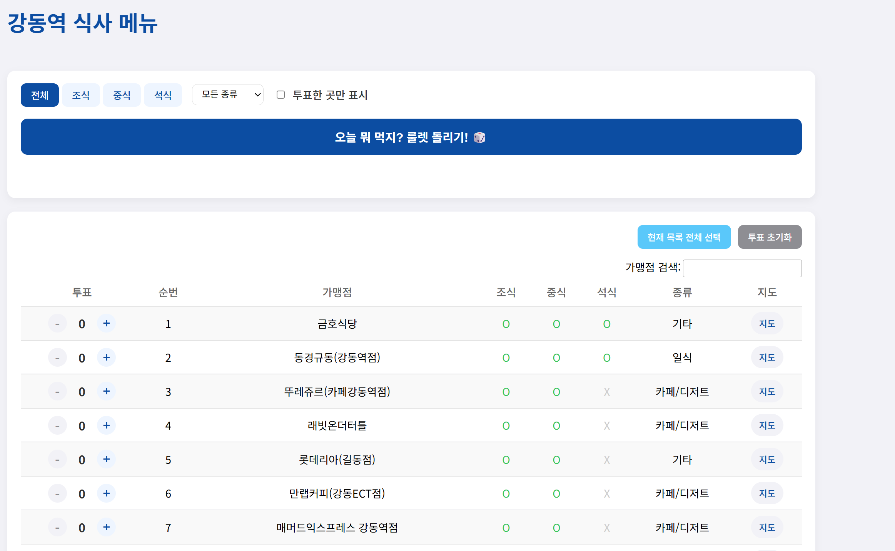

# 🎲 강동역 점심 룰렛 (Gangdong Station Lunch Roulette)

매일 반복되는 "오늘 뭐 먹지?"라는 고민을 해결하기 위해 제작된 웹 애플리케이션입니다. 강동역 주변의 다양한 식당 목록에서 필터링, 투표, 그리고 가중치 기반의 랜덤 선택 기능을 통해 메뉴 결정을 도와줍니다.



---

## ✨ 주요 기능 (Features)

- **🗳️ 가중치 기반 랜덤 선택**:
  - `+` 와 `-` 버튼으로 식당에 투표할 수 있습니다.
  - 투표 수가 많을수록 랜덤 선택 시 당첨될 확률이 높아집니다.
  - `오늘 뭐 먹지? 룰렛 돌리기! 🎲` 버튼을 눌러 오늘의 메뉴를 선택하세요!

- **🔎 강력한 필터링**:
  - **식사 시간**: 조식, 중식, 석식 가능 여부에 따라 식당을 필터링합니다.
  - **음식 종류**: 한식, 일식, 카페 등 원하는 카테고리만 선택하여 볼 수 있습니다.
  - **투표한 곳만 보기**: 내가 투표한 식당들 중에서만 랜덤 선택을 원할 때 유용한 필터입니다.

- **📜 인터랙티브한 식당 목록**:
  - 90개 이상의 식당 데이터를 [DataTables.js](https://datatables.net/) 플러그인을 사용하여 제공합니다.
  - `가맹점 검색` 기능으로 원하는 식당을 빠르게 찾을 수 있습니다.

- **🚀 빠른 실행 버튼**:
  - **현재 목록 전체 선택**: 필터링된 모든 식당에 1표씩 투표합니다.
  - **투표 초기화**: 모든 투표를 한 번에 초기화합니다.
  - **지도 보기**: 각 식당 옆의 `지도` 버튼을 누르면 네이버 지도에서 위치를 바로 확인할 수 있습니다.

- **📱 반응형 디자인**:
  - iOS 스타일을 참고한 깔끔하고 모던한 UI를 제공합니다.
  - 데스크톱과 모바일 환경 모두에서 최적화된 화면을 지원합니다.

---

## 🛠️ 기술 스택 (Tech Stack)

- **Frontend**: HTML5, CSS3, JavaScript (ES6)
- **Libraries**:
  - [jQuery](https://jquery.com/)
  - [DataTables.js](https://datatables.net/)

---

## 🚀 시작하기 (Getting Started)

이 프로젝트는 별도의 서버나 빌드 과정 없이 바로 실행할 수 있습니다.

1.  **프로젝트 클론 또는 다운로드**
    ```bash
    git clone [https://github.com/your-username/your-repository-name.git](https://github.com/your-username/your-repository-name.git)
    ```

2.  **`index.html` 파일 열기**
    -   다운로드한 폴더에서 `index.html` 파일을 웹 브라우저로 열면 바로 사용할 수 있습니다.

---

## ⚙️ 사용 방법 (How to Use)

1.  **옵션 필터링**: 원하는 식사 시간(조식/중식/석식)이나 음식 종류를 선택하여 식당 목록을 좁힙니다.
2.  **선호도 투표**: 마음에 드는 식당의 `+` 버튼을 눌러 투표합니다. 여러 번 눌러 가중치를 높일 수 있습니다.
3.  **룰렛 실행**: `오늘 뭐 먹지? 룰렛 돌리기! 🎲` 버튼을 클릭하여 오늘의 식당을 확인합니다.
4.  **결과 확인**: 🎉 오늘의 식당이 화면에 표시됩니다!

---

## 📄 데이터 출처 (Data Source)

-   [cite_start]식당 목록은 제공된 `강동식당.csv` 파일을 기반으로 `data.js` 파일을 생성하여 사용하였습니다. [cite: 1]